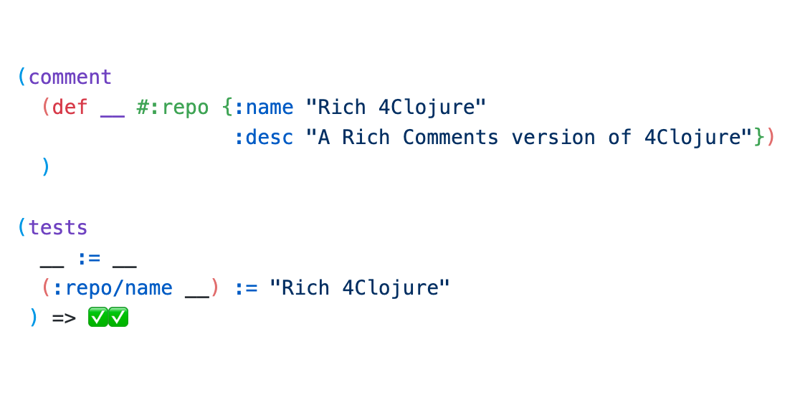

# Rich 4Clojure

*Practice Clojure using Interactive Programming in your editor.*



Welcome to the [Rich Comment Form](https://calva.io/rich-comments/) (RCF) port of 4Clojure! ❤️

## What it is

1. A repository that lets you learn and practice [Clojure](https://clojure.org), directly from the comfort of a Clojure REPL enhanced editor. (From your web browser, With zero installs, if you like.)
2. A ”copy” of the now closed **4clojure.com** site. It served us so wonderfully well!

_Anyway, if you have come here to practice Clojure, you are at the right place!_

## How it works

You solve programming problems using Clojure and your editor of choice. The problems are designed in increasing difficulty levels. You can use it to take your first baby steps in the language and also to hone your Clojure skills.

## Get started

To get to where you can start solving problems there are basically two alternatives:

1. Using [Calva](https://calva.io) in your browser ([Gitpod](https://gitpod.io)).
1. Fork and clone to your machine.
    1. Use **Calva**
    1. Use some other editor with Clojure abilities

### Calva in Gitpod - Zero installs!

This repository is prepared for [Gitpod](https://gitpod.io) such that both the [Clojure tools](https://clojure.org/guides/deps_and_cli) and [Calva](https://calva.io) are installed. So you can start training Clojure like so:

1. Open https://gitpod.io/#https://github.com/pez/rich4clojure in your web browser.
2. Click the **nREPL** button in the status bar
    
    1. Select **Start your project with a REPL server and connect (aka Jack-in)** from the quick pick menu
    2. Select **Rich 4Clojure** in the **Project types** menu.
3. Solve problems. See below.

#### I'm new to Calva

To learn the basics of Calva, use the **nREPL** button to **Disconnect from the REPL server** (if needed), then click the button again and select **Fire up the ”Getting Started” REPL server**.


See [calva.io/getting-started](https://calva.io/getting-started/) for what to expect.

#### I'm new to Clojure

Welcome to Clojure! There is a lot to learn and many concepts to grasp. But fear not!

* Since you are using this Gitpod friendly project, you don't need to install anything and can wait with having to understand all the things about how Clojure is wired up and such.
* The [**Getting Started REPL**](https://calva.io/getting-started/) mentioned above also sports a basic Clojure guide.
* The problems in this repository starts of from easy and are designed to build up your Clojure skills.

#### OK, so what is Gitpod?

Gitpod is a development environment that runs in your web browser. It uses [VS Code](https://code.visualstudio.com). You can open any **GitHub**/**GitLab**/**Bitbucket** repository in the Gitpod development environment by prepending the repository URL with `https://gitpod.io/#`. That's how this repository's Gitpod URL is constructed:

[https://gitpod.io/#https://github.com/pez/rich4clojure](https://gitpod.io/#https://github.com/pez/rich4clojure)


See https://gitpod.io for the full story.

### On your machine

This option can be easy, if you have Java and the Clojure tools installed and you know how to work with Clojure projects in your editor. It can also be a bit cumbersome if you don't. (In this case, I suggest you use Gitpod first and have some fun with the 4Clojure problems before you invest the time to figure out how to install the things.)

Once you have Java and the Clojure tools installed:

0. Clone this repo to your machine.

If you are using VS Code, install Calva and follow the same instructions as for the Gitpod option above, from step 2 and on.

If you are using some other editor:

1. Open the project in your Clojure-enabled editor.
1. Start the project REPL and connect it to your editor session.
1. Load the file `dev/repl.cljc`.
    * This will enable the test runner to run the problem tests that you find in each problem file.
    * If you are using Calva Jack-in as per above, this will be done automatically for you.

## Find problems

The problems reside, each in separate `.clj` files, in subfolders of the general difficulty level:

1. `src/rich4clojure/elementary`
1. `src/rich4clojure/easy`
1. `src/rich4clojure/medium`
1. `src/rich4clojure/hard`

Find suitable/fun problems and hack away on it. Right now the original site's guidance on which order to take on the problems are not translated to this repo, but generally just in numerical order at the difficulty level of your choice should work.

## Solve problems

Each problem has at least:

1. A title
1. A description
1. A definition of the symbol `__`
    ```clojure
    (def __ :tests-will-fail)
    ```
    * The tests reference this symbol. You are sometimes supposed to redefine it to something that makes the tests pass, and sometimes you will need to edit the `(tests ...)` form and replace this symbol with something else.
1. An ”open” `(comment ...)` form (a Rich Comment Form, RFC)
1. A `(tests ...)` form

Some problems also have restrictions, e.g:

```clojure
(def restricted [map mapcat])
```

Restrictions list ”things” shipped with **Clojure** that your solution is not allowed to use. Your editor's *lookup* features can give you documentation and defintions for the restricted symbols. Sometimes using the restricted ”things” in your solution, or just peeking at their documentation can help you find solutions that don't use them.

### Running the tests

The process of taking on a problem is:

0. Open the file
1. Load the file
    * This will run the tests and they will fail. A failing test looks something like so:
    ```
    clj:rich4clojure.easy.problem-39=>
    ; Evaluating file: problem_39.clj
    ❌ rich4clojure.easy.problem-39:21 
    in (__ [30 20] [25 15])

    [25 15]
    :≠
    [30 25 20 15]

    ...
    ```
1. Make the tests pass.
    * A successful test run looks something like so:
    ```
    clj:rich4clojure.easy.problem-39=>
    ; Evaluating file: problem_39.clj
    ✅✅✅✅
    ```

To rerun the tests, either reload the file or evaluate the `(tests ...)` form. This depends a bit on the problem and on your workflow. Here's a suggestion for problems which wants you to define a function:

1. Start with moving the `(def __ :tests-will-fail)` form inside the `(comment ...)` form
1. Redefine `__` to a function that will make the tests pass
    ```clojure
    (defn __ [x y z] ...)
    ```
**NB**: For some problems you rather need to edit the tests and *replace* each instance of `__` with your answer.

Basically, treat both the `(comment ...)` and the `(tests ...)` forms as your RCFs. Think, fiddle, evaluate, think, fiddle, evaluate, ... until you have found the solution.

### Solved it?

_Each problem has a **gist** linked at the bottom._ Please consider sharing your solution as a comment on the gist. Other Clojurians will benefit from seeing how you solved it.

Also: 🍰 **Congratulations!** 🎉 Now take on the next problem!

#### Stuck?

The `#4clojure`, `#beginners` and `#clojure` channels at the [Clojurian's Slack](http://clojurians.net/) might be places to ask for help. You can also try the [Discussions](https://github.com/PEZ/rich4clojure/discussions) tab in this repo. Also: _Each problem has a **gist** linked at the bottom._ The gist's comment section might contain solutions from other users. Sometimes a peek is enough to give some guidance. But, yeah, major **spoiler alert**.

## What about the name?

The name, **Rich 4Clojure**, comes from the fact that it relies on [Rich Comments](https://calva.io/rich-comments/) and also uses a test utility called [RCF](https://github.com/hyperfiddle/rcf) which is building on the same philosophy. Also, reading it like ”rich forclosure”, haha (or something)!

## Work in progress

This is an early version from a quite automated translation of the original problems. There'll be dragons. Please consider filing issues, starting [discussions](https://github.com/PEZ/rich4clojure/discussions), or chat me up on the [Clojurian's Slack](http://clojurians.net/) (I'm **@pez**, there).

PR:s are also welcome. If it is the content of a particular problem you want to suggest changes for, edit the `etc/problems.edn` file.

## Support the project

Consider starring ⭐ this repository, pretty please. 🙏

Please also consider contributing. Issues and pull requests are welcome. Right now the ”other editor” instructions can improve greatly, especially with **Editor X** configuration added to this repository. Please consider sending PRs with instructions and settings for your favorite editor.

The [Discussions](https://github.com/PEZ/rich4clojure/discussions) tab is also there for us to discuss both the project and solutions.

If you want to contrubute with problems, that is also super welcome. I suggest you start that with adding it as a suggestion in [Discussions](https://github.com/PEZ/rich4clojure/discussions). Then, if we agree the problem should be added, add it as a PR to the `etc/problems.edn` file, and I will generate the files and gists from it. (Until I've set up a CI/CD pipeline.)

If you want to encourage my work with this project you are welcome to sponsor me:

* [Sponsor Peter Strömberg a.k.a. PEZ](https://github.com/sponsors/PEZ) ❤️

## See also

* [4ever-clojure](https://4clojure.oxal.org) – A web based ”always up” copy of the original 4Clojure. It has listings of all working solutions that that were submitted to the original site.