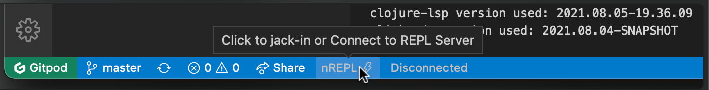

# How to use Rich 4Clojure

You will be solving problems one at a time, each in a separate `problem_###.clj` file.

First you need to start the project and connect the editor to its REPL. This is how you do it using Calva:

1. Click the **REPL** button in the status bar
    
    <details><summary>Don't see the REPL button?</summary>
    
    This could be because some firewall or adblocker prevents the downloading of the Calva extension. See [issue #9](https://github.com/PEZ/rich4clojure/issues/9) for more clues on this.
    
    </details>
1. Select **Start your project with a REPL server and connect (aka Jack-in)** from the quick pick menu
1. Select **Rich 4Clojure** in the **Project types** menu.

The **REPL** button will turn Calva-yellow when the REPL is connected. Now Calva is ready to be used for solving problems! See below.

Or, maybe _you_ don't feel ready just yet?

<details>
<summary>
I am new to Calva
</summary>

To learn the basics of using the Clojure REPL with Calva, use the **REPL** button and select **Fire up the ”Getting Started” REPL**.


(If you are already connected, you'll first need to select **Disconnect from the REPL server**. Then click the button again.)

See [calva.io/getting-started](https://calva.io/getting-started/) for what to expect.

</details>


<details>
<summary>
I am new to Clojure
</summary>

Welcome to Clojure! ❤️ 

There is a lot to learn and many concepts to grasp. But fear not!

* With the Gitpod option provided with this repository, you don't need to install anything and can wait with having to understand all the things about how Clojure is wired up and such.
* The [**Getting Started REPL**](https://calva.io/getting-started/) (see *I am new to Calva*) also sports a basic Clojure guide.
* The problems in this repository starts of from really easy and are designed to build up your Clojure skills.

</details>
<br/>

## Find problems

The problems reside, each in separate `.clj` files, in subfolders of the general difficulty level:

1. `src/rich4clojure/elementary`
1. `src/rich4clojure/easy`
1. `src/rich4clojure/medium`
1. `src/rich4clojure/hard`

Find suitable/fun problems and hack away on it. Right now the original site's guidance on which order to take on the problems are not translated to this repo, but generally just in numerical order at the difficulty level of your choice should work.

## Solve problems

Each problem has at least:

1. A title
1. A description
1. A definition of the symbol `__`
    ```clojure
    (def __ :tests-will-fail)
    ```
    * The tests reference this symbol. You are sometimes supposed to redefine it to something that makes the tests pass, and sometimes you will need to edit the `(tests ...)` form and replace this symbol with something else.
1. An ”open” `(comment ...)` form (a Rich Comment Form, RFC)
1. A `(tests ...)` form

Some problems also have restrictions, e.g:

```clojure
(def restricted [map mapcat])
```

Restrictions list ”things” shipped with **Clojure** that your solution is not allowed to use. Your editor's *lookup* features can give you documentation and defintions for the restricted symbols. Sometimes using the restricted ”things” in your solution, or just peeking at their documentation can help you find solutions that don't use them.

### Running the tests

The process of taking on a problem is:

0. Open the file
1. Load the file (run the command **Calva: Load Current File and Dependencies**)
    * This will run the tests and they will fail. A failing test looks something like so:
    ```
    clj:rich4clojure.easy.problem-39=>
    ; Evaluating file: problem_39.clj
    ❌ rich4clojure.easy.problem-39:21 
    in (__ [30 20] [25 15])

    [25 15]
    :≠
    [30 25 20 15]

    ...
    ```
1. Make the tests pass.
    * A successful test run looks something like so:
    ```
    clj:rich4clojure.easy.problem-39=>
    ; Evaluating file: problem_39.clj
    ✅✅✅✅
    ```

To rerun the tests, either reload the file or evaluate the `(tests ...)` form. This depends a bit on the problem and on your workflow. Here's a suggestion for problems which wants you to define a function:

1. Start with moving the `(def __ :tests-will-fail)` form inside the `(comment ...)` form
1. Redefine `__` to a function that will make the tests pass
    ```clojure
    (defn __ [x y z] ...)
    ```
**NB**: For some problems you rather need to edit the tests and *replace* each instance of `__` with your answer.

Basically, treat both the `(comment ...)` and the `(tests ...)` forms as your RCFs. Think, fiddle, evaluate, think, fiddle, evaluate, ... until you have found the solution.

### Solved it?

_Each problem has a **gist** linked at the bottom._ Please consider sharing your solution as a comment on the gist. Other Clojurians will benefit from seeing how you solved it.

Also: 🍰 **Congratulations!** 🎉 Now take on the next problem!

### Stuck?

The `#4clojure`, `#beginners` and `#clojure` channels at the [Clojurian's Slack](http://clojurians.net/) might be places to ask for help. You can also try the [Discussions](https://github.com/PEZ/rich4clojure/discussions) tab in this repo. Also: _Each problem has a **gist** linked at the bottom._ The gist's comment section might contain solutions from other users. Sometimes a peek is enough to give some guidance. But, yeah, major **spoiler alert**.
